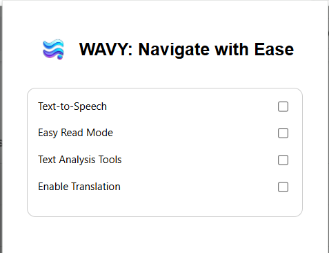
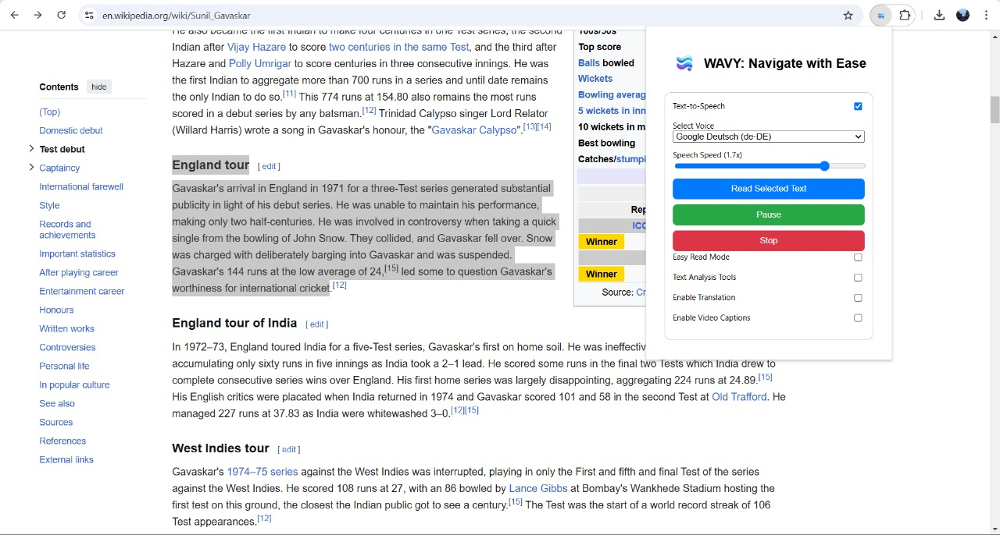
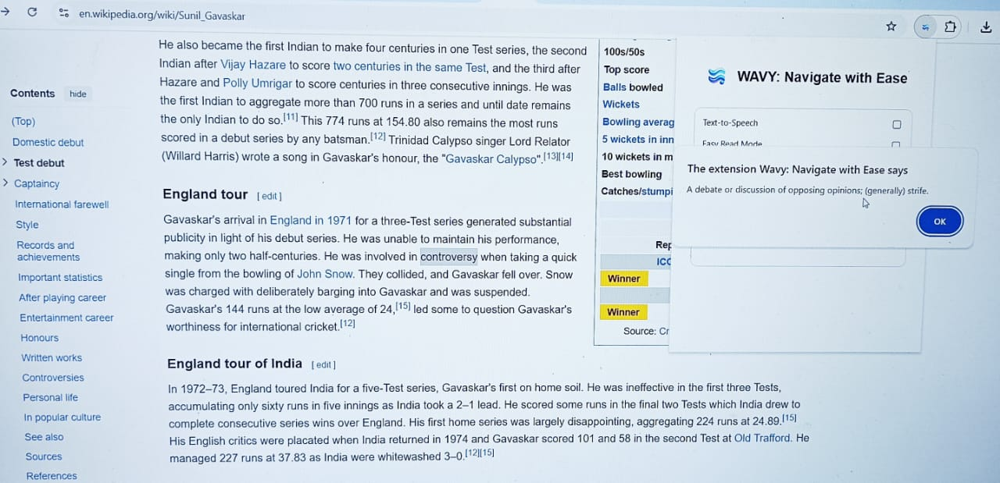
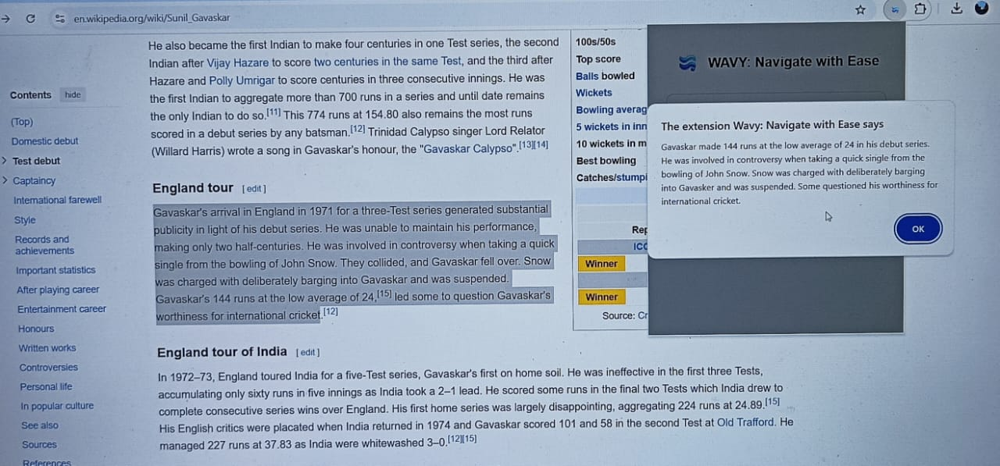
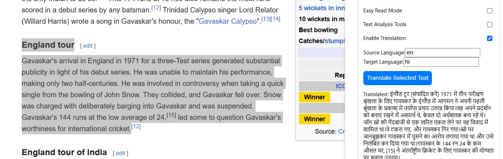
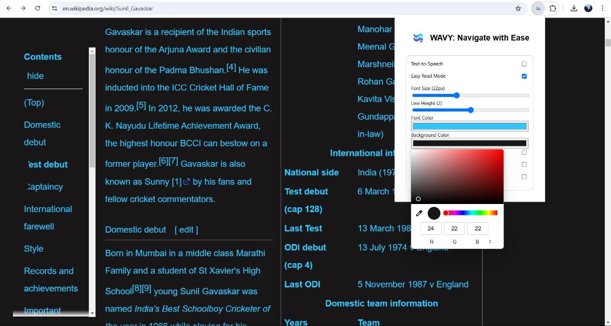

   
# WAVY: Navigate with Ease  

**WAVY** is a powerful AI-powered **Chrome extension** designed to enhance web accessibility and user experience. It leverages **cutting-edge NLP, machine learning, and AI** to transform the way users interact with digital content.  

## Features  
 **1. AI-Powered Text-to-Speech (TTS)** – Listen to web content effortlessly with natural-sounding AI voices.  
**2. Smart Summarization & Word Definition** – Get concise AI-generated summaries and instant word meanings.  
**3. Multilingual Translation** – Translate text seamlessly between multiple languages.  
**4. Adaptive Readability Mode** – Customize fonts, line height, text, and background color for an improved reading experience.  

## How WAVY Fits into Emerging Technologies  
WAVY leverages **state-of-the-art AI and NLP models** to redefine digital accessibility. By combining **TTS, real-time translation, adaptive UI, and AI-generated insights**, it transforms traditional web browsing into an **inclusive, user-friendly, and intelligent** experience.  

## 🖥️ Screenshots & Demo  

### 📌 **Screenshots**  
Below are some images showcasing WAVY's key features:  

1. **WAVY Main Interface**  
      

2. **Text-to-Speech in Action**  
     

3. **AI Summarization & Word Definition**  
     
     

4. **Language Translation**  
     

5. **Easy Read Mode**  
     

### 🎥 **Demo Video**  
Check out WAVY in action!  

 
